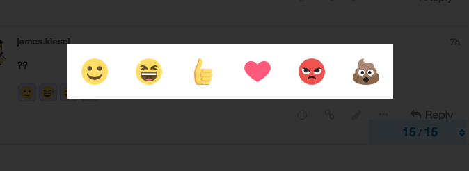
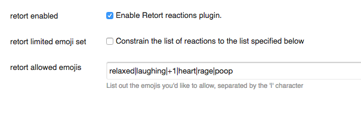

# Retort - A Reaction Plugin for Discourse

Retort allows you and your users to add slack-style reactions to your discourse posts.

Check out a quick gif of it in action [here](http://recordit.co/7vHi2j74Rg.gif)!

### Installation
- Edit your web template and add the project clone url. (https://meta.discourse.org/t/install-a-plugin/19157)
- Rebuild your web container so that the plugin installs.

You're done!

### Limiting the possible emoji set

Some communities will want to limit the possible reactions to just a few, rather than all possible emojis. Retort now supports this!

In order to use a limited emoji set, simply visit `admin/site_settings/category/plugins`, and check the box which says 'Constrain the list of reactions to the list specified below'.

Then, enter the list of emojis you'd like to support, delimited by the '|' character.
(So, for example, if you only wanted to support thumbs up / thumbs down reactions, you'd put in `+1|-1`)

Feel free to style elements underneath the `.retort-picker` class in `Admin > Customize > HTML/CSS`, if you need further customizations like emoji size, spacing, etc.

### Limiting the number of reactions per post

There's an additional site setting, 'retort allow multiple reactions', which determines whether users can react to a single post multiple times or not. (It is enabled by default). If you only want users to be able to create one reaction per post (if you're using Retort as a voting system, for example), set this option to false.

### Contributing

Pull requests welcome! To contribute:
- [Fork it] (../../fork )
- Create your feature branch (`git checkout -b your-new-feature`)
- Commit your changes (`git commit -am 'Add some feature`)
- Push to the branch (`git push origin your-new-feature`)
- Create a new Pull Request
